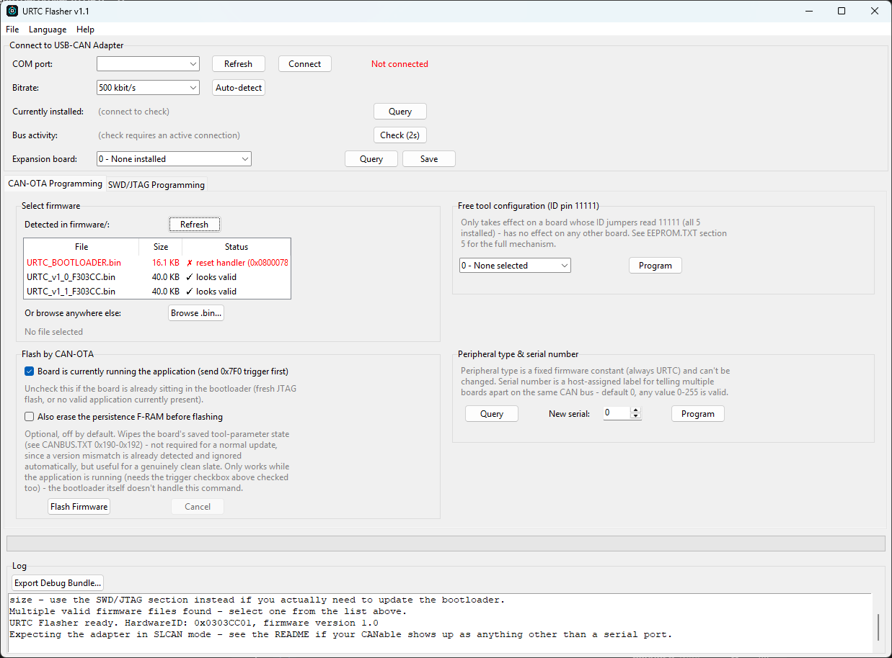

<p align="center">
  
</p>

# URTC Flasher (Windows / Linux)

<p align="center">
  <a href="README.md">🇺🇸 English</a> |
  <a href="README_spa.md">🇪🇸 Español</a> |
  <a href="README_fra.md">🇫🇷 Français</a> |
  🇮🇹 <b>Italiano</b> |
  <a href="README_deu.md">🇩🇪 Deutsch</a> |
  <a href="README_zho.md">🇨🇳 简体中文</a> |
  <a href="README_jpn.md">🇯🇵 日本語</a>
</p>


<p align="left">
  
  
  
  
</p>


**Versione:** 0.1.0 (la versione di questo strumento - mostrata nel banner
della finestra e nella barra del titolo, tracciata separatamente dalla
versione del firmware della scheda URTC che scrive. Segue uno schema
X.Y.Z in cui il numero di patch aumenta automaticamente a ogni build
reale tramite build_exe.bat/build_exe.sh - vedi CHANGELOG.md per la
cronologia delle versioni e bump_version.py per la regola esatta di riporto)

**Autore:** JuanenRac (Electro Hobby 3D) &lt;electrohobby3d@gmail.com&gt;

Licenza: **GPL-3.0** per il codice sorgente, **CC BY-SA 4.0** per questa
documentazione - vedi `LICENSE` in questo repository, o la sezione
"Licenza e Note sul Copyright" alla fine di questo documento.

Un piccolo strumento GUI multipiattaforma per aggiornare il firmware
della scheda URTC via bus CAN. Implementa esattamente il protocollo del
bootloader di `docs/CANBUS.TXT`: la verifica dell'HardwareID, la firma
HMAC-SHA256, il flusso di aggiornamento con slot di backup a immagine
dorata, il progresso in tempo reale tramite i messaggi di heartbeat del
bootloader, e un'interrogazione di versione (identifica se
l'applicazione *o* il bootloader di questa scheda si annuncia via CAN)
così puoi vedere cosa è attualmente installato prima di decidere cosa
flashare.

Due modi per parlare con la scheda, entrambi usando lo stesso protocollo
sottostante:

- **Seriale / SLCAN** — funziona su Windows e Linux. Serve un adattatore
  USB-CAN con firmware SLCAN, collegato come porta seriale virtuale.
- **SocketCAN** — **solo Linux**, e mostrato solo nell'interfaccia dello
  strumento su Linux. Parla direttamente con un'interfaccia di rete del
  kernel `can0`/`slcan0`. Se il tuo adattatore esegue già firmware
  `gs_usb`/candleLight (la maggior parte delle schede CANable lo fa di
  fabbrica), questo percorso **non richiede alcun reflash
  dell'adattatore** — il driver nativo di Linux lo gestisce
  direttamente.

**Stato:** il calcolo di CRC32 e HMAC-SHA256 in questo strumento è stato
verificato byte per byte contro l'implementazione C stessa del
bootloader, e il packing delle trame SocketCAN è stato verificato contro
il layout `struct can_frame` di Linux con un test di
packing/unpacking andata e ritorno. Ciò che **non** è stato testato su
nessuna delle 2 piattaforme è una scheda reale su hardware reale -
tratta il primo vero tentativo di flash con la stessa cautela che
daresti a qualsiasi nuovo strumento che parla con un bootloader: tieni a
portata di mano il JTAG come ripiego.

## 1. 🔌 Fai parlare CAN al tuo adattatore
Quale di questi ti serve dipende dalla tua piattaforma e da quale
trasporto userai:

**Linux, percorso SocketCAN (consigliato se il tuo adattatore lo
supporta):**
Niente da flashare sull'adattatore stesso. Attiva l'interfaccia una
volta per avvio (o aggiungila alla configurazione di rete per farla
persistere):
```
sudo modprobe can vcan gs_usb   # gs_usb copre la maggior parte delle schede della famiglia CANable
sudo ip link set can0 type can bitrate 500000
sudo ip link set can0 up
```
Se il tuo adattatore si enumera con un nome diverso da `can0`, controlla
`ip link show` (o `dmesg` subito dopo averlo collegato) per il nome
reale. Alcuni adattatori richiedono `slcand` invece di un driver nativo
- se `ip link show` non mostra alcuna interfaccia CAN dopo averlo
collegato, questo è probabilmente il tuo caso; consulta la
documentazione del tuo adattatore per l'invocazione di `slcand`, che
crea un'interfaccia `slcan0` che poi attivi allo stesso modo di sopra.

**Windows, o Linux tramite il percorso Seriale/SLCAN:**
Una CANable Pro v2 viene spedita di default con firmware
**candleLight**, che parla con l'host usando il protocollo `gs_usb` -
lo stesso che il driver `gs_usb` di SocketCAN su Linux si aspetta
nativamente (vedi sopra). Quel protocollo **non** si presenta come
porta seriale, che è ciò di cui ha bisogno questo percorso. Per usare
Seriale/SLCAN invece (obbligatorio su Windows; opzionale su Linux):

1. Scarica firmware compatibile con SLCAN per il tuo adattatore (cerca
   "canable slcan firmware" — ci sono alcuni fork mantenuti; usa quello
   indicato dalla documentazione del tuo adattatore).
2. Metti l'adattatore in modalità DFU/bootloader (di solito un pulsante
   BOOT tenuto premuto durante l'accensione, o un jumper - controlla la
   documentazione del tuo adattatore).
3. Flasha il firmware SLCAN usando lo strumento di flash del produttore
   del tuo adattatore o `dfu-util`.
4. Ricollega - ora dovrebbe enumerarsi come porta seriale: una porta COM
   su Windows, o in stile `/dev/ttyACM0`/`/dev/ttyUSB0` su Linux.

Se il tuo adattatore esegue già firmware SLCAN, salta direttamente al
passo 2 qui sotto.

Una riga SLCAN ricevuta la cui lunghezza reale non corrisponde a ciò che
implica il suo stesso DLC dichiarato viene trattata come malformata e
saltata, invece che analizzata dai suoi primi N caratteri esadecimali
indipendentemente da ciò che segue - utile da sapere se stai facendo
debug contro un adattatore rumoroso o non standard.

## 2. 💻 Installazione ed esecuzione
**Windows:**
```
python -m pip install -r requirements.txt
python urtc_flasher.py
```
Oppure compila un `.exe` standalone con `build_exe.bat` (vedi quel
file).

**Linux:**
```
python3 -m pip install -r requirements.txt
python3 urtc_flasher.py
```
Oppure compila un binario standalone con `./build_exe.sh` (prima
`chmod +x`).

Entrambi gli script passano `--noconfirm` a PyInstaller, quindi
ricompilare sopra un `dist/URTC_Flasher` già esistente lo sostituisce
direttamente invece di aspettare un prompt "sostituire?" facile da
perdere nell'output di uno script.

Il pannello di connessione mostra anche il marchio ufficiale HYDRA-UMC
animato. La sua sorgente SVG mantenuta è `assets/HYDRA_UMC_ICON.svg`; dodici
fotogrammi PNG inclusi conservano l’animazione in Tkinter e nell’eseguibile
autonomo senza aggiungere una dipendenza grafica a runtime. L’icona nativa
URTC della finestra/barra delle applicazioni rimane volutamente statica.

### Console visiva di controllo

La console di comando condivisa **Qt Quick** è disponibile per il flusso
CAN-OTA reale:
~~~
python urtc_flasher.py --qtquick
~~~
Usa gli stessi trasporti di produzione, la stessa validazione e lo stesso
codice di flash firmato dell'interfaccia consolidata. Tkinter resta
l'interfaccia predefinita finché le schermate avanzate SWD/JTAG e di
configurazione scheda non raggiungono la parità funzionale; non usare ancora
Qt Quick per tali operazioni avanzate.

Il flusso consolidato CAN-OTA e SWD/JTAG è mantenuto su una superficie di
controllo blu notte/ciano: intestazione di prodotto, scheda di connessione ad
alto contrasto, tabelle firmware leggibili, registro di verifica scuro e
progresso visibile. È un miglioramento visivo e di accessibilità; non altera
il protocollo del bootloader né il comportamento di sicurezza hardware.

### Barra dei menu

- **File** - Salva Registri (il registro a schermo come testo semplice;
  per un pacchetto più completo che include diagnostica di sistema e il
  file firmware attualmente selezionato, vedi "Diagnostica" più sotto),
  ed Esci.
- **Lingua** - passa tra le 7 lingue disponibili (vedi "Lingua" più
  sotto per come funzionano le traduzioni).
- **Aiuto** - Readme (apre questo file in una finestra visualizzatore di
  sola lettura; recupera automaticamente una versione tradotta appena
  ne esiste una per la lingua corrente), GitHub di URTC (apre il
  repository del progetto nel tuo browser), Licenza (la licenza GPL-3.0
  di questo strumento, letta dal file `LICENSE` stesso del repository),
  e Informazioni (versione e autore).

**All'avvio**, il banner si mostra centrato sullo schermo per 5 secondi
prima che appaia la finestra principale - non fa parte della finestra
principale stessa (per questo la finestra è piuttosto compatta per
quanto effettivamente fa). L'icona di finestra/barra delle applicazioni
è un piccolo design standalone (`assets/urtc_icon.png`/`.ico`), non il
banner rimpicciolito - l'illustrazione completa del banner non regge
bene a 16-32px.

**Lingua**: inglese di default.
Si cambia tramite il menu **Lingua** (nella barra dei menu in alto nella
finestra) invece di un menu a tendina nella finestra principale - salva
immediatamente in `urtc_config.json` (lo stesso file usato per gli
override tecnici dell'hardware — la preferenza della lingua vive
semplicemente accanto a quelli), applicato al prossimo avvio. Le
traduzioni vivono in file di testo semplice sotto `language/`
(`english.lng`, `spanish.lng`, `italian.lng`, `french.lng`,
`german.lng`) come semplici coppie `CHIAVE=Valore`, una per riga - le
righe che iniziano con `#` e le righe vuote vengono ignorate, e un `\n`
letterale dentro un valore diventa un vero a capo (usato dalla manciata
di messaggi di dialogo multi-riga). Modificabile direttamente se una
traduzione necessita correzione, o come punto di partenza per un'altra
lingua (aggiungi `language/<nome>.lng`, aggiungi `("<nome>", "Nome
Nativo")` a `AVAILABLE_LANGUAGES` vicino all'inizio di
`flasher_config.py`, e imposta `"language": "<nome>"` in
`urtc_config.json`). Una chiave mancante da un file di lingua ricade nel
mostrare il nome della chiave stessa invece di andare in crash, e un
file di lingua mancante o illeggibile (modifica errata, nome file
sbagliato) ricade sull'inglese per l'intera interfaccia - in entrambi i
casi lo strumento resta usabile mentre si risolve il disallineamento.

Tkinter (il toolkit della GUI) viene fornito con Python su Windows, ma
sulle distro della famiglia Debian/Ubuntu è un pacchetto del sistema
operativo separato:
```
sudo apt install python3-tk
```
(Fedora: `sudo dnf install python3-tkinter`. Arch: `sudo pacman -S tk`.)
`build_exe.sh` controlla questo da solo e ti avvisa se manca invece di
fallire a metà.

**Permessi seriali su Linux:** se stai usando il percorso Seriale/SLCAN
e la connessione fallisce con "Permission denied", il tuo utente deve
essere nel gruppo proprietario dei dispositivi seriali (`dialout` su
Debian/Ubuntu; varia su altre distro):
```
sudo usermod -a -G dialout $USER
```
Esci e rientra (l'appartenenza al gruppo viene letta al login), poi
riprova. Lo strumento rileva questo errore specifico e mostra questa
stessa soluzione in un dialogo, ma vale la pena saperlo in anticipo.
SocketCAN non ha questo problema particolare — l'accesso a
un'interfaccia tipo `can0` non è controllato dal gruppo `dialout` — ma
attivare l'interfaccia in primo luogo (passo 1 sopra) richiede comunque
`sudo`, poiché è una modifica alla configurazione del dispositivo di
rete.

Usare `python -m pip`/`python3 -m pip` invece di un `pip` semplice evita
un problema comune su entrambe le piattaforme: lo script wrapper di
`pip` stesso non è sempre nel PATH anche subito dopo un'installazione
riuscita, mentre `-m pip` trova il modulo installato direttamente.

## 3. 📁 Dove vanno i file di firmware
Questo strumento si aspetta una cartella `firmware/` proprio accanto a
`urtc_flasher.py`, nella radice di questo stesso repository:

```
├── assets/
│   ├── URTC_LOGO_FLASHER.svg      <- sorgente del banner (vettoriale)
│   └── urtc_banner.png            <- mostrato in cima alla finestra, renderizzato dal .svg sopra
├── firmware/
│   ├── URTC_V1.1_F303CC.bin      <- metti qui i nuovi file .bin
│   └── URTC_SLAVE_APP.bin        <- app del chip slave di espansione, se applicabile
├── logs/                          <- creato automaticamente, un file per sessione
├── urtc_config.json               <- opzionale, non incluso di default (vedi "Cambiare la chiave HMAC" sotto)
├── urtc_flasher.py                <- punto di ingresso: argomenti CLI, splash screen, impostazione finestra principale
├── flasher_config.py              <- I/O file di configurazione, caricamento lingua, costanti del protocollo
├── flasher_transports.py          <- SLCAN, SocketCAN, MockCAN
├── flasher_swd_tools.py           <- wrapper STM32CubeProgrammer / pyOCD
├── flasher_validation.py          <- validazione file firmware (.bin/.hex/.elf)
├── flasher_protocol.py            <- la macchina a stati CAN OTA stessa, sia per la scheda principale che (inoltrato tramite il proprio bridge I2C) per lo slave di espansione
├── flasher_github.py               <- scarica firmware dal repository GitHub proprio di questo progetto
├── flasher_gui.py                 <- la finestra principale (FlasherGUI) e la sua barra dei menu
├── requirements.txt
├── build_exe.bat                  <- build standalone per Windows
├── build_exe.sh                   <- build standalone per Linux
└── README.md
```

Questo strumento è organizzato nei moduli sopra per responsabilità,
puramente per leggibilità - non c'è alcuna differenza funzionale tra
averli come file separati o come uno grande, e non esiste una forma
monolitica da mantenere sincronizzata come invece accade per il firmware
(questo è uno strumento PC, non qualcosa che viene flashato sulla
scheda, quindi c'è solo questa forma).

`assets/urtc_banner.png` è opzionale - se manca, lo strumento si avvia
semplicemente senza banner invece di fallire. Viene caricato tramite il
supporto PNG nativo di tkinter (Tk 8.6+, incluso in ogni versione
attuale di Python), non Pillow, quindi non aggiunge una nuova
dipendenza. Sia `build_exe.bat` che `build_exe.sh` già impacchettano
`assets/` nell'eseguibile standalone tramite `--add-data` di
PyInstaller, quindi funziona allo stesso modo sia che tu esegua dal
sorgente sia da un binario compilato.

Questo è deliberato: l'intero repository è autonomo. Se vuoi solo
flashare una scheda - su un PC di officina, da una chiavetta USB,
ovunque - puoi copiare questo repository da solo, e funziona comunque.

**Puoi tenerne più di uno `.bin` lì.** Ogni file firmware applicativo
viene controllato ed elencato - lo strumento non prende semplicemente
il primo che trova, e i binari bootloader (qualsiasi cosa con
"BOOTLOADER" nel nome - `URTC_BOOTLOADER.bin`,
`URTC_SLAVE_BOOTLOADER.bin`) vengono filtrati completamente da questa
lista, poiché CAN-OTA flasha solo firmware applicativo; un
aggiornamento del bootloader richiede invece SWD/JTAG (sezione 6
sotto). All'avvio (e ogni volta che clicchi **Aggiorna**), ogni `.bin`
rimanente in `firmware/` viene controllato contro lo stesso test di
plausibilità che il bootloader stesso applica a un'immagine nuova (i
suoi primi 4 byte devono sembrare un puntatore di stack iniziale reale
per la RAM di questo chip, e la sua dimensione deve entrare nello slot
principale). Ogni file appare nella lista con un ✓ o ✗ chiaro e il
motivo:

| File | Dimensione | Stato |
|---|---|---|
| URTC_V1.1_F303CC.bin | 30.9 KB | ✓ sembra valido |
| URTC_SLAVE_APP.bin | 12.4 KB | ✓ sembra valido |
| notes.txt.bin | 0.1 KB | ✗ la prima parola non sembra un puntatore di stack valido |

- **Esattamente un file passa il controllo** → viene selezionato per te
  nel momento in cui lo strumento si avvia. Un file non valido da solo
  nella cartella *non* viene auto-selezionato solo perché niente altro
  compete con esso.
- **Più di un file valido** → nulla viene auto-selezionato; scegli
  quello che vuoi dalla lista.
- **Selezioni comunque un file che sembra non valido** → lo strumento ti
  chiede prima di confermare. Questo controllo esiste per rilevare
  errori ovvi (file sbagliato, download troncato, un segnaposto vuoto) -
  non può rilevare tutto (un file corrotto ma plausibile, o uno firmato
  con la chiave sbagliata), a cui serve il controllo CRC32/HMAC del
  bootloader stesso durante il trasferimento reale.
- **Niente trovato, o vuoi un file da tutt'altra parte** → usa il
  pulsante **Sfoglia .bin...**, che funziona indipendentemente da dove
  vive realmente il file (ed esegue lo stesso controllo di validazione
  in entrambi i casi).
- **Vuoi l'ultima build senza doverla cercare tu stesso** → **Scarica da
  GitHub...** recupera l'elenco file corrente direttamente dalla
  cartella `firmware/` propria di questo progetto
  (`github.com/JuanenRac/URTC/tree/main/firmware`) e ti permette di
  sceglierne uno da scaricare direttamente nella tua cartella
  `firmware/` locale - poi appare nell'elenco sopra come qualsiasi
  altro file, senza bisogno di riavviare. Usa l'API pubblica propria di
  GitHub (non autenticata, quindi soggetta al proprio limite di
  frequenza GitHub di 60 richieste/ora se la usi molto in poco tempo) -
  niente qui richiede un account GitHub o un token.

**`<nomefile>.manifest.json` opzionale, accanto a un file firmware**
(es. `URTC_V1.1_F303CC.bin.manifest.json`), aggiunge un controllo di
sanità extra e non bloccante: se presente, il suo campo `sha256` viene
confrontato con il file reale appena prima di flashare, con
`version`/`build_date` registrati accanto come riferimento.

```json
{"version": "1.1", "build_date": "2024-01-15", "sha256": "e5a4918c..."}
```

Una discrepanza viene registrata come un avviso chiaro, non un blocco
totale - questo è un controllo di comodità per rilevare precocemente un
file ovviamente sbagliato o corrotto, non un sostituto della verifica
HMAC del bootloader stesso durante il trasferimento reale, che rimane
comunque il controllo autoritativo.

Aggiungere una build nuova più tardi: basta metterla in `firmware/` e
cliccare **Aggiorna** - nessun riavvio necessario.

## 4. 🔍 Controllare cosa è attualmente installato
Se sei su Linux e SocketCAN è disponibile, vedrai una scelta di
**Trasporto** in alto - scegli Seriale/SLCAN o SocketCAN prima di
connettere. Su Windows questa riga non appare affatto; Seriale/SLCAN è
l'unica opzione.

Clicca **Connetti**, e lo strumento chiede automaticamente alla scheda
cosa sta eseguendo attualmente (CAN ID `0x7F8` → `0x7F9` - vedi
`docs/CANBUS.TXT`). Questo funziona sia che la scheda stia eseguendo
normalmente la sua applicazione *sia* che si trovi nel bootloader, quindi
non serve provocare un reset solo per scoprirlo. Clicca **Interroga**
in qualsiasi momento dopo per ricontrollare (utile subito dopo che un
flash è completato, per confermare che la nuova versione sia
effettivamente stata applicata).

**Quando è il bootloader stesso a rispondere** (scheda ferma nel
bootloader, non in esecuzione della sua applicazione), riporta anche la
propria versione - una cosa separata dalla versione dell'applicazione
installata, tracciata tramite il proprio `BOOTLOADER_VERSION_MAJOR/
MINOR/PATCH` in `bootloader_common.h` e inviata come seconda trama (`0x7FA`)
proprio accanto a `0x7F9`. L'applicazione in esecuzione non invia mai
questo - non ha modo di sapere la versione di un bootloader attualmente
flashato se non chiedendolo al bootloader stesso, quindi questo appare
solo quando la scheda è effettivamente lì (subito dopo `0x7F0`, o a un
avvio nuovo prima che salti all'applicazione).

Cosa vedrai:

- **`v1.1 (application, HardwareID 0x0303CC01)`** - caso normale,
  applicazione in esecuzione, tutto corrisponde.
- **`Bootloader running, no valid firmware currently installed,
  bootloader v1.1.2`** - la scheda è bloccata nel bootloader senza
  niente a cui saltare (chip vuoto, o ogni controllo sullo slot
  principale è fallito). Questa è esattamente la situazione per cui
  esiste questo strumento - flashala. La versione di bootloader
  mostrata qui è quella del bootloader stesso, senza relazione con
  qualsiasi versione di applicazione che abbia fallito i suoi controlli.
- **`⚠ HardwareID mismatch!`** mostrato in rosso - qualcosa ha risposto,
  ma il suo HardwareID non corrisponde a ciò che si aspetta questo
  strumento. Non flashare senza prima capire perché; il bootloader
  rifiuterebbe comunque l'aggiornamento, ma una discrepanza qui può
  anche significare che stai puntando alla scheda sbagliata del tutto.
- **Nessuna risposta** (rosso) - scheda non risponde, bitrate sbagliato,
  o non effettivamente collegata. Controlla la connessione fisica e, sul
  percorso SocketCAN, che l'interfaccia sia effettivamente attiva
  (`ip link show`).

**Scheda di espansione:** un menu a tendina separato e una coppia
Interroga/Salva, subito sotto il controllo versione. Legge e imposta
quale delle 7 configurazioni possibili di `CONN_EXPANSION` (nessuna, o
una delle 6 varianti reali - vedi `EXPANSION.TXT`) è fisicamente
installata, via CAN (`0x1A0`/`0x1A1`). Non c'è modo elettrico per la
scheda di rilevarlo da sola, quindi va detto - questo vive qui (non solo
in `URTC Tester`) poiché è un passo di configurazione hardware una
tantum fatto più naturalmente insieme a un aggiornamento firmware.
**Salva** chiede prima conferma, poiché questo persiste tra i cicli di
accensione finché non viene esplicitamente cambiato di nuovo.

**Variante sensore MLX9064x:** stessa forma del controllo scheda di
espansione sopra - un menu a tendina e una coppia Interroga/Salva che
legge/imposta quale dei 3 sensori termici della famiglia MLX9064x (o
nessuno) è effettivamente installato, via CAN (`0x1A6`/`0x1A7` - vedi
`CANBUS.TXT`). Rilevante solo quando la scheda di espansione sopra è
configurata come variante Advanced o Basic+MLX9064x; il firmware
proprio della scheda ignora completamente questa impostazione su
qualsiasi altro tipo di scheda di espansione. "Nessuno installato" (il
valore predefinito sicuro) deliberatamente non ricade nell'assumere
MLX90640 - una scheda con un MLX90640 reale collegato necessita che
questo venga impostato esplicitamente, una volta, allo stesso modo in
cui il tipo di scheda di espansione stesso già richiede.

## 5. ⚡ Flashare
1. **Connetti**: scegli Seriale/SLCAN o SocketCAN (solo Linux), poi la
   porta/interfaccia, poi clicca Connetti. Per Seriale/SLCAN questo apre
   il canale CAN a 500 kbit/s (la velocità di bus fissa di URTC); per
   SocketCAN si presume che l'interfaccia sia già a quella velocità
   (passo 1 sopra) - questo strumento non la imposta. In entrambi i
   casi, la versione attuale viene interrogata automaticamente - vedi
   sezione 4 sopra.
2. **Scegli una destinazione di flash**: "Questa scheda (principale)" o
   "Slave di espansione" - predefinito sulla scheda principale, il caso
   di gran lunga più comune. L'opzione slave raggiunge qualcosa solo su
   una variante di scheda di espansione Advanced (TMC2209+STM32F303CBT6
   o TMC5160A+STM32F303CBT6) - l'aggiornamento viene inoltrato tramite
   il bridge I2C proprio della scheda principale verso il chip slave (i
   propri `0x210`-`0x218` di `CANBUS.TXT`), non una connessione fisica
   separata. "Cancella F-RAM prima di flashare" (passo 4 sotto) si
   disabilita automaticamente selezionando Slave - il chip slave non ha
   F-RAM propria da cancellare.
3. **Seleziona firmware**: scegli dalla lista rilevata, o Sfoglia - vedi
   sezione 3 sopra per sapere esattamente come funzionano rilevamento e
   validazione.
4. **Flasha**:
   - Lascia spuntato "La scheda sta attualmente eseguendo l'applicazione"
     se la scheda è accesa e funziona normalmente - lo strumento invia
     prima il trigger a payload magico `0x7F0` (o `0x210`, inoltrato
     allo slave, se Slave è la destinazione selezionata), che spegne in
     sicurezza ogni attuatore prima di resettare verso il bootloader.
   - Deseleziona se la scheda è già nel bootloader (subito dopo un
     flash JTAG nuovo, o se il controllo versione sopra ha mostrato
     "no valid firmware currently installed").
   - Clicca **Flasha Firmware** e conferma - il dialogo di conferma
     indica quale destinazione stai per flashare, quindi verifica che
     corrisponda a ciò che intendevi realmente selezionare. Il registro
     mostra ogni passo del protocollo; la barra di progresso segue il
     progresso di scrittura pagina per pagina durante il trasferimento,
     poi il progresso di copia durante la copia finale da backup a
     principale.

Se la verifica fallisce in qualsiasi punto (discrepanza CRC32, HMAC, o
HardwareID), lo slot principale del bootloader non viene mai toccato -
la scheda continua a eseguire il firmware che aveva già. È sempre sicuro
semplicemente riprovare.

**Backup Firmware (CAN)**: legge il firmware attualmente installato
tramite il bus, invariato, e lo salva come file `.bin` - l'equivalente
CAN della funzione SWD "back up entire flash before erasing" (sezione 6
sotto), per lo stesso motivo. Vale la pena farlo prima di qualsiasi
aggiornamento, specialmente prima di un downgrade deliberato (sotto),
poiché è l'unico modo per recuperare i byte esatti di oggi in seguito se
non hai più il file che li ha generati. Solo scheda principale, e solo
mentre la scheda è effettivamente nel bootloader - richiede un
bootloader che implementi `0x7FE`/`0x7FF` (vedi `docs/CANBUS.TXT`); uno
datato semplicemente non risponde mai, mostrato come un chiaro timeout
invece di un file silenziosamente vuoto.

**Installare deliberatamente una versione precedente**: il bootloader
normalmente rifiuta un'immagine validamente firmata se dichiara una
versione precedente a quella già installata (motivo di fallimento
verifica "rollback rifiutato") - questo impedisce che una versione con
una vulnerabilità già scoperta venga reinstallata. Se hai davvero bisogno
di tornare a una versione precedente di cui ti fidi, seleziona **"Consenti
il downgrade (bypassa l'anti-rollback) per questo aggiornamento"** (solo
scheda principale) prima di flashare - appare una seconda finestra di
conferma, poiché questo bypassa deliberatamente un controllo di
sicurezza. Questo carica comunque l'immagine precedente completa
attraverso il normale trasferimento, solleva solo il controllo
dell'ordine delle versioni per quel tentativo (`0x7FD` - vedi
`docs/CANBUS.TXT`); il numero di versione comunicato alla scheda proviene
dal `.manifest.json` del file quando ne esiste uno accanto ad esso (vedi
sezione 3 sopra), ricadendo sulla versione attualmente configurata di
questo strumento altrimenti, registrato chiaramente in ogni caso in modo
che non sia mai una supposizione silenziosa.

## 6. 🛠️ Programmare il chip completo via SWD/JTAG (avanzato)
La sezione "4. Program complete chip via SWD/JTAG" nello strumento fa un
flash completo di avvio - cancella l'intero chip in massa, poi scrive
da zero sia l'immagine del bootloader che quella dell'applicazione,
agli indirizzi reali del chip che corrisponde alla selezione **Chip di
destinazione** (vedi sotto). Questo è un **tipo di operazione
diverso** dalle sezioni 1-5 sopra:

|  | Aggiornamento CAN OTA (sezioni 1-5) | SWD/JTAG chip completo (sezione 6) |
|---|---|---|
| Auto-riparante se interrotto | Sì - lo slot di backup a immagine dorata garantisce che il firmware in esecuzione sopravviva | No - non eseguirà nulla finché non viene riprogrammato |
| Recuperabile | Automaticamente, nessuna azione necessaria | Sì - basta ricollegare e flashare di nuovo via SWD; la porta di debug non dipende dal contenuto della flash. Solo un vero blocco permanente (option byte RDP2) impedirebbe questo, e niente in questo strumento imposta option byte |
| Tocca il bootloader | Mai | Sì, per design |
| Richiede | Un adattatore USB-CAN | Una sonda SWD/JTAG (ST-Link o simile) |
| Uso tipico | Aggiornamenti firmware di routine | Primo avvio su un chip vuoto, o recupero di una scheda inutilizzabile |

**Chip di destinazione:** "Questa scheda (principale)" o "Slave di
espansione" - stesse 2 opzioni del selettore proprio della scheda
CAN-OTA, ma una scelta genuinamente separata qui: SWD/JTAG richiede una
sonda fisicamente collegata al chip corrispondente a questa selezione,
poiché non esiste alcun bridge (a differenza di CAN-OTA) che permetta a
una singola connessione di raggiungere entrambi. Cambiare questo
modifica automaticamente gli indirizzi flash usati:

| | Scheda principale (STM32F303CC) | Slave di espansione (STM32F303CBT6) |
|---|---|---|
| Indirizzo bootloader | `0x08000000` (regione 32K) | `0x08000000` (regione 18K) |
| Indirizzo applicazione | `0x08008000` (regione 112K) | `0x08005000` (regione 54K) |
| Stringa target pyOCD | `stm32f303cc` | `stm32f303cb` |

Entrambe le stringhe target sopra sono la migliore ipotesi di questo
progetto sul nome reale del target pyOCD per ciascun chip, non
confermata contro un'installazione pyOCD dal vivo mentre questo veniva
scritto (la copertura STM32 in pyOCD arriva in gran parte tramite
CMSIS-Pack piuttosto che target integrati) - se il flashaggio fallisce
con un errore tipo "target not found", esegui tu stesso `pyocd list
--targets --name stm32f303` e `pyocd pack install <il nome reale>`
scarica il CMSIS-Pack corretto.

**Richiede uno tra** (lo strumento rileva automaticamente quale è
disponibile e abilita solo quelli che trova):
- **pyOCD** - `pip install pyocd`. Libero, open-source, nessuna
  installazione separata oltre al pacchetto pip.
- **STM32CubeProgrammer** - lo strumento ufficiale di ST, installato
  separatamente da [st.com](https://www.st.com). Se lo hai già per
  altri lavori STM32, non serve installare nient'altro qui.

Entrambi vengono eseguiti come sottoprocessi da riga di comando, non
importati come librerie Python - vedrai il comando esatto registrato
prima che venga eseguito.

**Formati file:** `.bin` (richiede l'indirizzo fisso che questo
strumento già conosce - non lo inserisci tu) o `.hex` (porta il proprio
indirizzo, usato così com'è). Mescolare va bene - bootloader come
`.hex` e applicazione come `.bin`, o viceversa, entrambi funzionano.
Entrambi i selettori file validano il file scelto (dimensione plausibile
per lo slot di destinazione, e - dove il formato permette di
controllarlo con sicurezza - un puntatore di stack iniziale plausibile)
prima di lasciarti procedere, allo stesso modo in cui già faceva il
selettore firmware del percorso CAN.

**La connessione viene controllata prima che venga eseguito nulla di
distruttivo**, richiedendo **evidenza positiva** di una sonda/target
reale invece della sola assenza di un errore - il codice di uscita
stesso di STM32CubeProgrammer non è un segnale affidabile di
successo/fallimento da solo, quindi un controllo di connessione dedicato
(`pyocd list --probes`, o un `-c port=SWD` solo-connessione per
STM32CubeProgrammer) viene eseguito prima che il passo di cancellazione
in massa lo faccia mai. L'output di ogni comando successivo viene anche
esaminato per testo di fallimento noto come seconda protezione, nel caso
il codice di uscita di uno strumento da solo non sia affidabile in
qualche altra situazione.

**Il dry run è attivo di default.** La prima volta, lascialo spuntato e
premi "Flash Complete Chip" - stampa i comandi esatti nel registro senza
toccare la scheda. Leggili, conferma che percorsi e indirizzi sembrino
corretti, *poi* deseleziona il dry run e fallo per davvero.

**"Back up entire flash before erasing"** legge prima l'intera regione
flash da 256KB in un file `.bin`, tramite il comando stesso di
lettura-memoria-su-file dello stesso strumento (`-r` per
STM32CubeProgrammer, `commander savemem` per pyOCD) - un'assicurazione
reale qui, poiché a differenza di un aggiornamento CAN OTA (che lo slot
di backup a immagine dorata già protegge), una cancellazione completa
del chip non ha altro annullamento. Disattivato di default poiché
aggiunge 10-30s e non serve su un chip nuovo/vuoto; vale la pena
spuntarlo prima di sovrascrivere una scheda che sta già eseguendo
qualcosa. Se la lettura non produce effettivamente un file, la
cancellazione viene rifiutata invece di procedere senza il backup che
hai richiesto.

**Stato dei test:** la logica di controllo connessione sopra è stata
verificata contro output reale di STM32CubeProgrammer (sia un genuino
log di connessione riuscita sia un fallimento documentato "No target
connected", entrambi provenienti dal forum comunitario stesso di ST) e
contro lo scenario esatto di falso successo che ha colpito un utente
reale. La sequenza completa di cancellazione/programmazione/verifica
contro un vero ST-Link e un vero STM32F303CC non è ancora stata
esercitata end-to-end - l'ambiente che ha scritto questo non ha accesso
USB. Tratta un primo vero tentativo completo con la dovuta cautela -
prima una scheda di riserva/test se ne hai una, e tieni presente un
piano di riserva (lo strumento di flash stesso di STM32CubeIDE, o
`st-flash`) nel caso qualcosa della tua specifica versione di pyOCD o
sonda non corrisponda a ciò che si assume qui.

## 7. ⌨️ Modalità CLI (senza schermo, no GUI)
Per pipeline CI, banchi di prova, o scripting da linea di produzione
dove non c'è display:

```
python3 urtc_flasher.py --cli --port /dev/ttyACM0 --file firmware.bin
```

```
usage: urtc_flasher.py --cli [-h] [--transport {serial,socketcan}] --port PORT
                             --file FILE [--no-trigger] [--force]
```

Codici di uscita: `0` successo, `1` errore protocollo/connessione, `2`
argomenti errati o un file firmware che fallisce la validazione (passa
`--force` per flasharlo comunque), `130` annullato con Ctrl+C. Copre
solo il percorso di aggiornamento CAN OTA (sezioni 1-3) - il percorso
completo SWD/JTAG del chip è deliberatamente solo-GUI per ora, data
quanto più è in gioco se un'esecuzione scriptata ottiene una
combinazione file/target sbagliata senza che nessuno stia osservando.

**`--transport mock`** esegue l'intera sequenza di aggiornamento contro
un bootloader simulato, in memoria, invece di una scheda reale - nessun
adattatore, nessuna porta, niente di fisico coinvolto:

```
python3 urtc_flasher.py --cli --transport mock --file firmware.bin --no-trigger
```

Utile per testare la logica propria di questo strumento (comportamento
di retry, gestione timeout, codici di uscita) in una pipeline CI o prima
di toccare hardware reale - non qualcosa che parla con una scheda reale.
`--mock-fail 0x03` (o qualsiasi altro valore `VERIFY_FAIL_REASON_*` da
`docs/CANBUS.TXT`) fa fallire la verifica dell'aggiornamento simulato
invece di avere successo, per testare il percorso di fallimento allo
stesso modo.

## 8. 🔄 Affidabilità durante un aggiornamento CAN, e log di sessione
Se l'ACK di una pagina non arriva entro la normale finestra di 3s
durante un aggiornamento CAN, lo strumento riprova l'*attesa* (non un
reinvio dei dati della pagina) fino a due volte in più con un breve
backoff prima di arrendersi, recuperando da un ACK ritardato o perso su
un bus rumoroso senza che i dati sottostanti siano andati perduti.
Deliberatamente non reinvia i dati della pagina a un timeout - se i dati
originali sono effettivamente arrivati bene e si è perso solo l'ACK,
reinviare farebbe leggere al bootloader quei byte come l'inizio della
*prossima* pagina, desincronizzando il trasferimento. Ogni retry
controlla anche l'heartbeat stesso del bootloader (inviato
approssimativamente una volta al secondo) contro ciò che implicherebbe
aver ricevuto la pagina corrente per intero - quando sono coerenti, il
registro lo dice, il che è evidenza reale che i dati sono passati e si è
perso solo l'ACK, non solo un'attesa più lunga e una speranza.

Ogni sessione scrive anche un file di log con marca temporale in
`logs/` (`urtc_flasher_YYYYMMDD_HHMMSS.log`),
indipendente dal registro a schermo - utile per consegnare una traccia
completa a chi ha scritto il firmware se qualcosa va storto sul campo.
Questa cartella viene creata automaticamente ed è sicura da eliminare;
nulla rilegge vecchi log.

## 9. 📊 Diagnostica — attività bus, bitrate, e pacchetti di debug
**Selettore bitrate + auto-rilevamento** (solo Seriale/SLCAN): il bus di
URTC è fisso a 500 kbit/s, che rimane il default - questo serve per un
adattatore mal configurato o per il debug di una scheda non standard.
**Auto-rilevamento** prova ogni bitrate SLCAN standard a turno contro
un'interrogazione di versione e si ferma al primo che ottiene una vera
risposta; non ancora connesso quando ci clicchi. Il bitrate di SocketCAN
è impostato a livello di sistema operativo (`ip link`), quindi questo
controllo è disabilitato per quel trasporto - non c'è nulla qui da
provare.

**Attività bus** ("Controlla (2s)", accanto a Interroga): conta trame di
protocollo reali effettivamente viste durante una finestra fissa di 2
secondi sul trasporto connesso. Questo deliberatamente **non** è la
stessa cosa di una vera percentuale di carico bus CAN - richiederebbe
un'interrogazione netlink (SocketCAN) o estensioni specifiche
dell'adattatore (SLCAN) che questo strumento non ha un modo standard e
senza dipendenze per ottenere per il controller del *proprio adattatore*.
Ciò che dà: un segnale genuino,
direttamente misurato, di "c'è qualcosa che parla su questo bus, e
approssimativamente con quale frequenza", su entrambi i trasporti. Per
SocketCAN nello specifico, mostra anche il delta di 2 secondi delle
statistiche di interfaccia stesse di Linux
(`/sys/class/net/<iface>/statistics/`) - contatori base rx/tx/error/drop
che ogni interfaccia espone, letti come file semplici, nessuna
dipendenza extra. Connettersi via SocketCAN legge anche
`/sys/class/net/<iface>/carrier` - un file semplice 0/1 che ogni
interfaccia Linux espone. Quando un controller CAN va in bus-off, il
driver del kernel chiama `netif_carrier_off()`, quindi "nessun carrier"
qui è evidenza reale di un bus-off o link similmente morto, registrato
come avviso con il comando esatto di ripristino (`sudo ip link set
<iface> down && sudo ip link set <iface> up type can bitrate 500000
restart-ms 100`). Questo strumento non esegue quel comando da solo -
ripulire un vero bus-off richiede abbassare e rialzare l'interfaccia a
livello kernel, il che richiede root e conta come modifica alla
configurazione di rete di sistema, non qualcosa da fare silenziosamente
per tuo conto.

**Contatori di errore (TEC/REC)** (accanto ad Attività bus): a
differenza dei contatori dell'adattatore sopra, questo chiede alla
**scheda stessa** il proprio Transmit/Receive Error Counter del
controller CAN (`0x7FB`/`0x7FC` - vedi `docs/CANBUS.TXT`), risposto da
qualunque cosa sia in esecuzione in quel momento, applicazione o
bootloader. Verde significa che entrambi i contatori sono a 0
(error-active, sano); arancione significa che uno o entrambi sono
diversi da zero ma sotto 128 (ancora error-active, ma qualcosa sta
causando ritrasmissioni); rosso significa 128 o più (error-passive o
peggio) o nessuna risposta (firmware/bootloader datato che non
implementa ancora `0x7FB`, o scheda non connessa). Un TEC in costante
salita con un REC piatto in genere indica che le trasmissioni di questa
scheda non ricevono conferma - nessun altro nodo sul bus, o un problema
di cablaggio/terminazione/bitrate specifico della connessione di questa
scheda.

**Esporta Pacchetto Debug** (sopra il registro): salva uno `.zip` con il
registro attuale a schermo, diagnostica di base del sistema (SO,
versione Python, quali strumenti sono stati trovati, trasporto/porta/
bitrate attuale), e il file firmware CAN attualmente selezionato - utile
per consegnare un quadro completo a chi ha scritto il firmware se
qualcosa va storto sul campo, invece di copiare il registro
a mano.

## 10. 🔬 SWD/JTAG — formati file, verifica slot, e selezione sonda
**Formati file**: i selettori bootloader/applicazione della sezione SWD
accettano `.bin`, `.hex`, e `.elf`/`.axf`. ELF/AXF viene analizzato con
una piccola quantità di unpacking di struct scritto a mano (solo header
ELF + program header - niente simboli, niente section header),
deliberatamente senza usare `pyelftools`: questo progetto rimane a zero
dipendenze fuori dalla libreria standard, e il parsing ELF completo è
più di quanto serva a questo specifico controllo di plausibilità.
Verificato contro il `BOOTLOADER.elf`/`APP.elf` compilato reale di
questo progetto stesso - entrambi validano correttamente ai loro
indirizzi di caricamento reali (`0x08000000`/`0x08008000`), non solo
file di test sintetici. Solo ARM little-endian a 32 bit, che è tutto ciò
che un target Cortex-M è mai. La dimensione dichiarata di un file `.hex`
è il conteggio reale di byte occupati, non l'intervallo di indirizzi
dal suo record più basso al più alto - quindi un file sparso (un
piccolo blocco di firmware reale più un blocco distante e separato di
option byte o dati di calibrazione, che alcuni toolchain STM32
raggruppano in un'unica esportazione) valida sul suo contenuto reale
invece che sul divario tra loro. Un'immagine firmware grezza sotto
un'estensione diversa da `.bin` (`.img`, `.rom`, o nessuna estensione -
selezionabile tramite l'opzione "Tutti i file" del selettore file)
ottiene il suo indirizzo base da in quale slot lo stai caricando, allo
stesso modo di un `.bin`.

**Verifica slot bootloader/applicazione**: i selettori file verificano
che ogni immagine sia pensata per lo slot in cui viene messa, non solo
che sembri firmware valido di *qualche* tipo. Un'immagine bootloader e
una applicazione hanno un puntatore di stack ugualmente plausibile -
stesso chip, stessa RAM - quindi quel controllo da solo non può
distinguerle se una finisce nello slot dell'altra. Ciò che può: il
**gestore di reset** di un'immagine linkata è un indirizzo assoluto e
reale fissato al momento del linking, e punta solo dentro la regione
per cui è stata effettivamente linkata. Verificato contro il
`BOOTLOADER.bin`/`APP.bin` compilato reale di questo progetto stesso: i
loro gestori di reset sono `0x080030F1` e `0x0800C725` rispettivamente,
ciascuno correttamente dentro l'intervallo di indirizzi del proprio slot
e fuori da quello dell'altro - quindi mettere uno dei due nello slot
sbagliato viene rilevato e bloccato, non accettato in silenzio. La
stessa logica si applica a `.hex`/`.elf`, controllati contro il proprio
indirizzo di caricamento incorporato.

**Controlla Option Bytes** (sezione 4, solo STM32CubeProgrammer - pyOCD
non espone questo allo stesso modo via CLI): un dump di sola lettura
`-ob displ`, senza cancellazione/scrittura. Segnala il livello RDP con
la stessa cura che tutto questo strumento prende riguardo al rischio
SWD:
- **RDP0** - nessuna protezione, normale per una scheda di sviluppo.
- **RDP1** - reversibile tramite il Read Unprotect di CubeProgrammer, ma
  quello cancella il chip in massa come parte della rimozione - non
  qualcosa che questo strumento fa per te automaticamente.
- **RDP2** - l'unico blocco genuinamente **permanente** di tutto questo
  progetto. A differenza di ogni altro rischio documentato sopra (tutti
  recuperabili via SWD), RDP2 disabilita la porta di debug per sempre
  per design dello stesso ST. Questo controllo esiste per rilevarlo
  prima di un'operazione a chip completo, non dopo.

**Selezione sonda** (sezione 4): se più di uno ST-Link/sonda è connesso
alla volta, ogni comando richiede di sceglierne uno esplicitamente dal
menu a tendina Sonda - niente "quello che il SO enumera per primo". Con
esattamente una sonda connessa, viene auto-selezionata; con zero o
diverse, premi Aggiorna e scegli. Questo si applica sia al flash a chip
completo che al controllo option byte, poiché entrambi sono
sufficientemente vicini al distruttivo perché indovinare la scheda
sbagliata sia un rischio reale su un banco con più dispositivi.

**Le scritture di pyOCD sono verificate con una rilettura esplicita**,
non solo fidandosi del codice di uscita. Il comando `flash` stesso di
pyOCD salta la riscrittura di pagine che già corrispondono
(un'ottimizzazione di velocità, non un rapporto di verifica), quindi
questo strumento aggiunge un passo `commander compare` contro entrambe
le immagini dopo la scrittura - un vero controllo byte per byte, come
già fa il flag `-v` di STM32CubeProgrammer. Solo per `.bin`: `compare`
controlla il contenuto della flash contro i byte grezzi del file, il
che non corrisponderebbe correttamente alla codifica propria di un file
`.hex`/`.elf` anche dopo un flash riuscito, quindi quei 2 formati
saltano questo specifico passo e si affidano invece alla verifica
interna in tempo di scrittura propria di pyOCD.

## 11. 📡 Telemetria di trasferimento e dettaglio fallimento verifica
**Telemetria di trasferimento**: il registro mostra i KB/s effettivi e
il tempo trascorso per pagina durante un aggiornamento CAN, più una riga
di riepilogo alla fine (tempo totale, KB/s medio, quanti retry di ACK
pagina sono avvenuti). Puramente informativo - non cambia il
comportamento di flash, rende solo più facile distinguere a colpo
d'occhio "questo va solo lento" da "qualcosa non va davvero".

**Motivi specifici di fallimento verifica**: se la verifica fallisce
durante un aggiornamento CAN, `bootloader_protocol.c` invia un byte motivo
accanto allo stato `0x05` (verifica fallita) - trasferimento
incompleto, discrepanza CRC32, discrepanza HMAC, o discrepanza
HardwareID, invece che ogni fallimento sembri identico. Vedi
`docs/CANBUS.TXT` per il formato esatto della trama (`0x7F5`, DLC 2 per
questo stato specifico). Questo strumento e il bootloader concordano su
questo formato di trama, quindi flasha entrambi insieme se stai
costruendo un bootloader personalizzato con una versione diversa del
protocollo.

**Lo stesso dettaglio per lo slave di espansione**: un aggiornamento
fallito dello slave (Destinazione: "Slave di espansione") interroga
`0x219` subito dopo che `0x215` segnala `STATUS_VERIFY_FAIL`,
inoltrando il proprio `REG_VERIFY_FAIL_REASON` del bootloader slave -
gli stessi 5 motivi di sopra, solo raggiunti tramite il bridge I2C
invece che letti direttamente da una trama CAN. Richiede un bootloader
slave che implementi `0x219` (aggiunto insieme al supporto di questo
strumento per esso); un bootloader slave più vecchio semplicemente non
risponde a quella richiesta, e questo strumento ricade sul messaggio
generico "verifica fallita".

## 12. 🧹 Cancellazione opzionale della F-RAM prima di flashare
La sezione 3 ha una casella di controllo, **"Cancella anche la F-RAM di
persistenza prima di flashare"** - disattivata di default. Se spuntata,
invia il comando di cancellazione a payload magico (`0x192` - vedi
`docs/CANBUS.TXT`) alla F-RAM di persistenza FM24CL64B della scheda
prima che inizi la sequenza di aggiornamento, cancellando qualsiasi
stato di parametri strumento avesse salvato.

**Non necessario per un aggiornamento normale.** Una discrepanza di
versione nel layout stesso del record salvato viene già rilevata e
ignorata in sicurezza al prossimo avvio (vedi la sezione persistenza
parametri di `src/F303-master/README.md`) - questa casella esiste
per una pulizia genuinamente completa, non perché saltarla lascerebbe
qualcosa di rotto.

**Funziona solo mentre l'applicazione è in esecuzione** - il bootloader
stesso non gestisce affatto `0x192`, lo fa solo `firmware_can_global_post.c`. Questa
casella viene saltata in silenzio (con una riga di registro che spiega
perché) se la casella "la scheda sta attualmente eseguendo
l'applicazione" sopra non è spuntata, poiché in quel caso si presume che
la scheda sia già nel bootloader.

**Una conferma mancante non ferma il flash.** Se la trama di conferma
stessa del comando di cancellazione non torna entro 2 secondi, questo
viene registrato come avviso e l'aggiornamento firmware reale procede
comunque - cancellare è un passo secondario e opzionale accanto allo
scopo reale di questo strumento, non qualcosa che dovrebbe interrompere
un aggiornamento altrimenti riuscito per l'assenza della sua propria
trama di conferma. Controlla lo stato della F-RAM separatamente (il
pulsante Interroga Stato stesso di `URTC Tester`) se questo ti importa.

## 🔑 Cambiare la chiave HMAC / l'HardwareID

La chiave di firma condivisa vive in 2 posti che devono sempre
corrispondere: l'array `HMAC_KEY` di `bootloader_common.h`, e la costante
`HMAC_KEY` di questo strumento vicino all'inizio di `flasher_config.py`.
Se ne cambi una, cambia l'altra e ricompila/reflasha il bootloader prima
di provare a firmare qualsiasi cosa con la nuova chiave - un'immagine
firmata con una chiave che il bootloader non ha fallirà sempre la
verifica, in sicurezza, lasciando lo slot principale intatto.

**Oppure sostituisci qualsiasi cosa di questo senza toccare lo script:**
un `urtc_config.json` opzionale accanto a `firmware/` può impostare la
chiave di firma, l'HardwareID, e i valori della mappa di memoria - utile
per una revisione scheda diversa, una chiave ruotata, o (per i campi
della mappa di memoria) adattare questo strumento a una variante di chip
o schema di partizioni diverso, senza bisogno di una versione di script
nuova per ogni distribuzione:
```json
{
  "hardware_id": "0x0303CC01",
  "hmac_key_hex": "555254432D4859445241...",
  "app_max_size": 114688,
  "bootloader_max_size": 32768,
  "flash_page_size": 2048,
  "bootloader_flash_addr": "0x08000000",
  "app_flash_addr": "0x08008000"
}
```
Ogni campo è opzionale - sostituisci solo ciò che effettivamente sta
cambiando. Un file mancante ricade in silenzio sui default compilati; un
file presente ma rotto registra un avviso e ricade anch'esso su quei
valori, invece di far crashare lo strumento per un errore di battitura.
**Questo meccanismo di sostituzione si applica solo alle costanti
proprie della scheda principale** - gli equivalenti propri del chip
slave di espansione (`SLAVE_BOOTLOADER_FLASH_ADDR`,
`SLAVE_APP_FLASH_ADDR`, `SLAVE_HARDWARE_ID`, ecc.) sono fissi nel
proprio `flasher_config.py`, poiché i valori reali di quell'hardware
sono già confermati contro i propri script di linking reali invece di
richiedere una sostituzione a tempo di deployment come richiedono
invece i default propri della scheda principale. Quale fonte è attiva
viene registrato all'avvio, quindi è sempre visibile quali valori una
data sessione ha effettivamente usato. `hardware_id`
accetta sia una stringa JSON (`"0x0303CC01"`) che un numero JSON semplice
(`50580689`) - quale sia più naturale a seconda di come viene generato
il file. `app_max_size`, `bootloader_max_size`, `flash_page_size`,
`bootloader_flash_addr`, e `app_flash_addr` sono anch'essi sostituibili
qui, accanto alla chiave di firma e all'HardwareID sopra - utile se
questo strumento viene mai adattato a una variante di chip o schema di
partizioni diverso.

## 📸 Foto

<p align="center">
  
</p>

## 📂 Struttura del Repository

La cartella `assets/` contiene anche `HYDRA_UMC_ICON.svg`, la sorgente
vettoriale animata mantenuta, e `hydra_umc_icon_frames/`, i suoi dodici
fotogrammi PNG per Tkinter. `tools/render_hydra_umc_icon_frames.py` li
rigenera dall'SVG durante lo sviluppo; non è necessario per eseguire
l'applicazione.

```
├── assets/
│   ├── URTC_APP_ICON.svg          <- icona condivisa app/barra delle applicazioni (vettoriale)
│   ├── URTC_LOGO_FLASHER.svg      <- sorgente del banner (vettoriale), mostrato al centro per 5s all'avvio
│   ├── HYDRA_UMC_ICON.svg         <- sorgente vettoriale animata HYDRA-UMC mantenuta
│   ├── hydra_umc_icon_frames/     <- dodici fotogrammi PNG per Tkinter renderizzati dall'SVG sopra
│   ├── qml/
│   │   └── FlasherDeck.qml        <- UI Qt Quick del command deck CAN-OTA `--qtquick`
│   ├── urtc_banner.png            <- renderizzato dal .svg sopra, mostrato in cima alla finestra
│   ├── urtc_icon.ico              <- icona barra applicazioni/finestra su Windows
│   └── urtc_icon.png              <- icona barra applicazioni/finestra su Linux
├── firmware/
│   ├── URTC_MAIN_FIRMWARE_v0.2.5.bin     <- firmware applicativo attuale della scheda principale
│   ├── URTC_MAIN_BOOTLOADER_v0.3.4.bin   <- bootloader della scheda principale (solo SWD/JTAG, escluso dall'elenco
│   │                                         firmware CAN-OTA - vedi sezione 3 sopra)
│   ├── URTC_SLAVE_FIRMWARE_v0.1.4.bin    <- applicazione del chip slave di espansione (solo schede di espansione avanzate)
│   └── URTC_SLAVE_BOOTLOADER_v0.1.7.bin  <- bootloader del chip slave di espansione
├── images/
│   ├── URTC_FLASHER_BANNER.svg    <- banner del logo mostrato in cima a questo README
│   └── URTC_FLASHER_V1_1.png      <- screenshot reale della finestra, mostrato nella sezione Foto sopra
├── language/
│   ├── english.lng                <- lingua predefinita, coppie KEY=Value in testo semplice
│   ├── spanish.lng
│   ├── italian.lng
│   ├── french.lng
│   ├── german.lng
│   ├── japanese.lng
│   └── chinese.lng
├── logs/                           <- creata automaticamente, un file per sessione
├── urtc_config.json.example        <- modello per il file opzionale di override urtc_config.json
│                                       (vedi "Cambiare la chiave HMAC / l'HardwareID" sopra) - copialo
│                                       come urtc_config.json e modificalo, invece di partire da zero
├── urtc_flasher.py                <- punto d'ingresso: argomenti CLI, splash screen, configurazione finestra principale
├── qt_flasher.py                  <- front end Qt Quick - command deck CAN-OTA `--qtquick` reale,
│                                       riutilizza le stesse classi di trasporto/validazione/protocollo sotto
├── hydra_umc_animation.py         <- widget animato di identità HYDRA-UMC per Tkinter
├── hydra_umc_deck_widgets.py      <- widget arrotondati del command deck HYDRA-UMC condivisi dalle
│                                       superfici di diagnostica live
├── flasher_config.py              <- I/O del file di configurazione, caricamento lingua, costanti di protocollo
├── flasher_transports.py          <- SLCAN, SocketCAN, MockCAN
├── flasher_swd_tools.py           <- wrapper per STM32CubeProgrammer / pyOCD
├── flasher_validation.py          <- validazione dei file firmware (.bin/.hex/.elf)
├── flasher_protocol.py            <- la macchina a stati CAN OTA vera e propria
├── flasher_github.py              <- scarica firmware dal repository GitHub di URTC
├── flasher_gui.py                 <- la finestra principale (FlasherGUI) e la sua barra dei menu
├── requirements.txt                <- pyserial>=3.5 (tester Tkinter) + PySide6>=6.8,<7 (deck `--qtquick`)
├── build_exe.bat                  <- build standalone per Windows
├── build_exe.sh                   <- build standalone per Linux
├── build-test.bat                 <- controllo build/compilazione senza incremento di versione
├── build-test.sh                  <- lo stesso, per Linux
├── bump_version.py                <- incremento di versione stile contachilometri, eseguito dagli script di build
├── bump_manifest_version.py       <- sincronizza la versione di hydra-umc.project.json con quella nativa (--sync)
├── URTC_Flasher.spec              <- spec PyInstaller usata da entrambi gli script di build sopra
├── docs/
│   └── CLI_REFERENCE.md           <- riferimento dei flag della riga di comando
├── tools/
│   ├── ci_validate.py                    <- validazione manifest/CHANGELOG/docs usata dalla CI
│   └── render_hydra_umc_icon_frames.py   <- rigenera assets/hydra_umc_icon_frames/ dall'SVG (solo sviluppo)
├── README.md                      <- (versione in inglese)
├── README_ita.md                  <- questo file
├── README_spa.md / README_fra.md / README_deu.md / README_zho.md / README_jpn.md  <- altre traduzioni
├── LICENSE
├── .gitattributes
└── .gitignore
```

Questo strumento è organizzato nei moduli `flasher_*.py` sopra per
responsabilità, puramente per leggibilità - non c'è alcuna differenza
funzionale tra averli come file separati o come uno grande.

## 🔗 Progetti Correlati

Questo progetto fa parte dell'ecosistema robotico HYDRA-UMC dello stesso autore (JuanenRac / Electro Hobby 3D). Vale la pena conoscerlo, poiché una richiesta potrebbe in realtà riguardare uno di questi invece di questo repository.

**Progetto Padre**
- **[URTC](https://github.com/JuanenRac/URTC)** — firmware per la scheda fisica dell'Universal Robot Tool Controller, oltre 25 profili utensile su bus CAN; il genitore di cui questo repository è uno strumento specifico, all'interno della propria famiglia di strumenti CAN-bus.

**Progetti Fratelli** — gli altri strumenti della propria famiglia di strumenti CAN-bus di URTC
- **[URTC-TESTER](https://github.com/JuanenRac/URTC-TESTER)** — strumento desktop di diagnostica CAN-bus dal vivo per schede URTC, un pannello per profilo utensile.
- **[URTC-WEB-STUDIO](https://github.com/JuanenRac/URTC-WEB-STUDIO)** — alternativa basata su browser a URTC-TESTER tramite la Web Serial API, senza installazione locale.

**Direttamente Correlati**
- **[HYDRA-UMC-TOOL-CLI](https://github.com/JuanenRac/HYDRA-UMC-TOOL-CLI)** — CLI di flotta con un vero e stabile contratto di exit-code, un client live reale della stessa API di HYDRA-UMC-SERVER — fa su scala di flotta (il comando `flash-all`) ciò che questo strumento fa per una singola scheda.

**Fa Anche Parte dell'Ecosistema**

*Hardware e Piattaforma di Base*
- **[HYDRA-UMC](https://github.com/JuanenRac/HYDRA-UMC)** — la scheda madre fisica del braccio robotico: host CM5 + coprocessore STM32H745 dual-core, che coordina fino a 8 bracci utensile via CAN-OTA/SPI-OTA.
- **[HYDRA-UMC-OS](https://github.com/JuanenRac/HYDRA-UMC-OS)** — livello prodotto riproducibile su Raspberry Pi OS per il CM5: agente in sola lettura, config/profili validati, provisioning WiFi al primo contatto.
- **[HYDRA-UMC-SDK](https://github.com/JuanenRac/HYDRA-UMC-SDK)** — il contratto JSON-Schema condiviso e la barriera di sicurezza contro cui ogni bridge valida i propri comandi.

*Backend Centrale e Client*
- **[HYDRA-UMC-SERVER](https://github.com/JuanenRac/HYDRA-UMC-SERVER)** — il vero backend headless (REST/WebSocket) con cui parla davvero ogni client di controllo.
- **[HYDRA-UMC-STUDIO](https://github.com/JuanenRac/HYDRA-UMC-STUDIO)** — dashboard di controllo web con visualizzazione 3D multi-robot in tempo reale.
- **[HYDRA-UMC-SUITE](https://github.com/JuanenRac/HYDRA-UMC-SUITE)** — centro di comando sciame desktop (PySide6) per più server contemporaneamente, pacchettizzato come eseguibile standalone.
- **[HYDRA-UMC-ANDROID-CONTROL](https://github.com/JuanenRac/HYDRA-UMC-ANDROID-CONTROL)** — app di controllo nativa per Android con login biometrico e un companion Wear OS abbinato.
- **[HYDRA-UMC-IOS-CONTROL](https://github.com/JuanenRac/HYDRA-UMC-IOS-CONTROL)** — app di controllo per iOS/iPadOS (Flutter) con sincronizzazione WebSocket in tempo reale.
- **[HYDRA-UMC-DSI](https://github.com/JuanenRac/HYDRA-UMC-DSI)** — interfaccia touch nativa per il touchscreen DSI da 7" a bordo, incorporata direttamente nel CM5.
- **[HYDRA-UMC-EDITOR-URDF](https://github.com/JuanenRac/HYDRA-UMC-EDITOR-URDF)** — creatore/editor grafico desktop di URDF che invia i modelli finiti al catalogo di STUDIO.
- **[HYDRA-UMC-BRIDGE-AMR](https://github.com/JuanenRac/HYDRA-UMC-BRIDGE-AMR)** — barriera di coordinamento per flotte AGV/AMR tramite un publisher MQTT VDA 5050 reale.
- **[HYDRA-UMC-BRIDGE-CNC](https://github.com/JuanenRac/HYDRA-UMC-BRIDGE-CNC)** — coordinatore ad alto livello per celle CNC con accesso reale a stato/byte di controllo GRBL.
- **[HYDRA-UMC-BRIDGE-DROIDS](https://github.com/JuanenRac/HYDRA-UMC-BRIDGE-DROIDS)** — barriera di coordinamento per droidi con zampe/umanoidi, con un vero mittente di comandi per Boston Dynamics Spot.
- **[HYDRA-UMC-BRIDGE-LASER](https://github.com/JuanenRac/HYDRA-UMC-BRIDGE-LASER)** — coordinatore di sicurezza per celle laser che legge 3 salvaguardie GPIO reali di chiave/involucro/interblocco.
- **[HYDRA-UMC-BRIDGE-OPENPNP](https://github.com/JuanenRac/HYDRA-UMC-BRIDGE-OPENPNP)** — coordinatore ad alto livello sicuro per il flusso schede del pick-and-place OpenPnP.
- **[HYDRA-UMC-BRIDGE-PRINTER3D](https://github.com/JuanenRac/HYDRA-UMC-BRIDGE-PRINTER3D)** — barriera di coordinamento sicura per stampanti 3D Moonraker/Klipper, con comandi di lavoro reali e controllati.
- **[HYDRA-UMC-BRIDGE-ROS2](https://github.com/JuanenRac/HYDRA-UMC-BRIDGE-ROS2)** — coordinatore di sicurezza con un vero trasporto ROS 2 rclpy, importato in modo lazy.
- **[HYDRA-UMC-BRIDGE-UAV](https://github.com/JuanenRac/HYDRA-UMC-BRIDGE-UAV)** — barriera di coordinamento per UAV dotati di fotocamera, con un vero mittente di comandi MAVLink.

*Nodo IA Visione (Hailo-8)*
- **[HYDRA-UMC-VISION-NODE](https://github.com/JuanenRac/HYDRA-UMC-VISION-NODE)** — hub di integrazione per la pipeline di visione Hailo-8, con un vero controllo di prontezza hardware per fase.
- **[HYDRA-UMC-DETECTION-HEF](https://github.com/JuanenRac/HYDRA-UMC-DETECTION-HEF)** — registro reale di modelli compilati con verifica di caricamento sicuro per architettura Hailo/checksum.
- **[HYDRA-UMC-VISION-STREAMER](https://github.com/JuanenRac/HYDRA-UMC-VISION-STREAMER)** — generatore reale di pipeline GStreamer + config MediaMTX, con una vera barriera di integrazione HailoRT.
- **[HYDRA-UMC-VISUAL-SERVOING-API](https://github.com/JuanenRac/HYDRA-UMC-VISUAL-SERVOING-API)** — vera legge di correzione Position-Based Visual Servoing, con cancello di sicurezza sullo stato di zona a monte.
- **[HYDRA-UMC-SAFETY-ZONES](https://github.com/JuanenRac/HYDRA-UMC-SAFETY-ZONES)** — vero controllo di violazione zona e richiesta E-STOP, con imposizione della freschezza di calibrazione.

*Nodo IA Cognitivo (Hailo-10)*
- **[HYDRA-UMC-COGNITIVE-NODE](https://github.com/JuanenRac/HYDRA-UMC-COGNITIVE-NODE)** — hub di integrazione per la pipeline cognitiva Hailo-10 (orchestrazione LLM/VLA/voce).
- **[HYDRA-UMC-VLA-ENGINE](https://github.com/JuanenRac/HYDRA-UMC-VLA-ENGINE)** — vera codifica/decodifica di token d'azione e generazione di traiettoria per un modello Vision-Language-Action.
- **[HYDRA-UMC-VOICE-UI](https://github.com/JuanenRac/HYDRA-UMC-VOICE-UI)** — vero front-end vocale (VAD + parser di intenti) con un relay verso Watch limitato e soggetto a conferma.
- **[HYDRA-UMC-SEMANTIC-PLANNER](https://github.com/JuanenRac/HYDRA-UMC-SEMANTIC-PLANNER)** — vera scomposizione dei task basata su regole e recupero semantico degli errori sui codici errore MCU.
- **[HYDRA-UMC-DOCS-QA](https://github.com/JuanenRac/HYDRA-UMC-DOCS-QA)** — vera ricerca documentale TF-IDF (solo libreria standard) sui documenti Markdown di questo ecosistema.

*Orchestrazione e Sciame*
- **[HYDRA-UMC-ORCHESTRATOR](https://github.com/JuanenRac/HYDRA-UMC-ORCHESTRATOR)** — hub di integrazione con un vero contratto di health-report gRPC/Protobuf e una macchina a stati di missione.
- **[HYDRA-UMC-JOB-DISPATCHER](https://github.com/JuanenRac/HYDRA-UMC-JOB-DISPATCHER)** — vera coda di lavori basata su priorità con deduplicazione, su una vera API HTTP.
- **[HYDRA-UMC-NODE-HEALING](https://github.com/JuanenRac/HYDRA-UMC-NODE-HEALING)** — vero watchdog di salute della flotta basato su gRPC, con retry/backoff e rilevamento di discrepanza d'identità.
- **[HYDRA-UMC-PATH-PLANNER-3D](https://github.com/JuanenRac/HYDRA-UMC-PATH-PLANNER-3D)** — vero pianificatore di percorsi 3D basato su RRT, con vera validazione delle collisioni ostacolo/spazio di lavoro.
- **[HYDRA-UMC-SWARM-SYNC](https://github.com/JuanenRac/HYDRA-UMC-SWARM-SYNC)** — vera sincronizzazione di stato CRDT LWW-Element-Map, con property test per la convergenza multi-cella.

*Gemello Digitale e Simulazione*
- **[HYDRA-UMC-TWIN](https://github.com/JuanenRac/HYDRA-UMC-TWIN)** — hub di integrazione per il motore di gemello digitale, con un vero contratto di sincronizzazione per compatibilità di versione.
- **[HYDRA-UMC-HIL-BRIDGE](https://github.com/JuanenRac/HYDRA-UMC-HIL-BRIDGE)** — vero interblocco di sicurezza hardware-in-the-loop che instrada i comandi tra simulazione e hardware reale.
- **[HYDRA-UMC-PHYSICS-REPLICA](https://github.com/JuanenRac/HYDRA-UMC-PHYSICS-REPLICA)** — vera cinematica diretta e validazione dei limiti articolari su un vero sottoinsieme URDF.
- **[HYDRA-UMC-SYNTHETIC-DATA-GEN](https://github.com/JuanenRac/HYDRA-UMC-SYNTHETIC-DATA-GEN)** — vero generatore procedurale di scene 2D con esportazione di annotazioni YOLO/COCO.

*Dati e Analisi*
- **[HYDRA-UMC-DATALAKE](https://github.com/JuanenRac/HYDRA-UMC-DATALAKE)** — vero archivio di serie temporali basato su sqlite3, con una vera API HTTP di ingestione/query.
- **[HYDRA-UMC-ANOMALY-DETECTOR](https://github.com/JuanenRac/HYDRA-UMC-ANOMALY-DETECTOR)** — vero rilevatore di anomalie FFT + baseline statistica, con monitoraggio della deriva.
- **[HYDRA-UMC-PRODUCTION-REPORTS](https://github.com/JuanenRac/HYDRA-UMC-PRODUCTION-REPORTS)** — vero calcolo OEE/disponibilità sullo storico di DATALAKE, con esportazione CSV riproducibile.
- **[HYDRA-UMC-TELEMETRY-COLLECTOR](https://github.com/JuanenRac/HYDRA-UMC-TELEMETRY-COLLECTOR)** — vera pipeline di ingestione CAN/WebSocket verso DATALAKE, con deduplicazione per sequenza.

*Gateway Industriale*
- **[HYDRA-UMC-GATEWAY-INDUSTRIAL](https://github.com/JuanenRac/HYDRA-UMC-GATEWAY-INDUSTRIAL)** — hub di integrazione che inoltra ai protocolli industriali, con un vero livello di allowlist dei comandi/backpressure.
- **[HYDRA-UMC-OPCUA-SERVER](https://github.com/JuanenRac/HYDRA-UMC-OPCUA-SERVER)** — vero spazio di indirizzi OPC-UA, verificato con una vera sessione client del protocollo binario.
- **[HYDRA-UMC-MQTT-BROKER](https://github.com/JuanenRac/HYDRA-UMC-MQTT-BROKER)** — vero broker MQTT con autenticazione opzionale per client e ACL sui topic.
- **[HYDRA-UMC-MTCONNECT-ADAPTER](https://github.com/JuanenRac/HYDRA-UMC-MTCONNECT-ADAPTER)** — veri endpoint XML `/probe` e `/current` di MTConnect, con output in modalità degradata.

*Strumenti Complementari e Operazioni dell'Ecosistema*
- **[HYDRA-UMC-DASHBOARD-AI](https://github.com/JuanenRac/HYDRA-UMC-DASHBOARD-AI)** — pannelli Smart Summaries e Anomaly Highlighting su DATALAKE/ANOMALY-DETECTOR, con un fallback statistico onesto.
- **[HYDRA-UMC-WATCH](https://github.com/JuanenRac/HYDRA-UMC-WATCH)** — app companion WearOS con avvisi aptici reali e un relay vocale verso il telefono abbinato.
- **[URTC-SMART-RACK](https://github.com/JuanenRac/URTC-SMART-RACK)** — firmware per un rack di montaggio schede con decodifica reale dell'ID utensile e logica di preriscaldamento Smart Idle.
- **[URTC-VISION-TOOL](https://github.com/JuanenRac/URTC-VISION-TOOL)** — firmware più un vero companion di visione Python per una testa utensile di ispezione termica/RGB.
- **[HYDRA-UMC-UPDATER](https://github.com/JuanenRac/HYDRA-UMC-UPDATER)** — strumento amministrativo desktop che scopre, clona e aggiorna ogni repository di questo ecosistema.
- **[HYDRA-UMC-OS-REBUILDER](https://github.com/JuanenRac/HYDRA-UMC-OS-REBUILDER)** — strumento desktop Windows/Linux che costruisce un'immagine della CM5 pronta da scrivere, precaricata con le versioni più aggiornate dell'ecosistema, con configurazione di primo avvio Wi-Fi/utente/SSH in stile Raspberry Pi Imager.

## 📜 LICENZA

URTC Flasher è (c) 2026 JuanenRac (Electro Hobby 3D). Questo avviso
deve essere incluso in qualsiasi distribuzione di questo progetto o
lavoro derivato.

Questo progetto consiste di codice sorgente e propria documentazione,
resi disponibili sotto licenze diverse - ciascuna adatta a ciò che
effettivamente copre:

1. Il codice sorgente (`urtc_flasher.py` e ogni modulo `flasher_*.py`)
   e qualsiasi binario compilato a partire da esso tramite
   `build_exe.bat`/`build_exe.sh` sono disponibili sotto la
   **GNU General Public License v3.0 (GPL-3.0)**. Testo completo su
   https://www.gnu.org/licenses/gpl-3.0.html.

2. La documentazione (questo README e le proprie traduzioni -
   `README_spa.md`, `README_ita.md`, `README_fra.md`, `README_deu.md`,
   `README_zho.md`, `README_jpn.md`)
   è disponibile sotto **Creative Commons Attribution-ShareAlike 4.0
   International (CC BY-SA 4.0)**. Testo completo su
   https://creativecommons.org/licenses/by-sa/4.0/.

Questo strumento è il compagno di flashing CAN-OTA/SWD-JTAG del
progetto [URTC (Universal Robot Tool Controller)](https://github.com/JuanenRac/URTC)
- vedi il repository proprio di quel progetto per il firmware della
scheda, i design hardware, e la documentazione completa del protocollo
contro cui lavora questo strumento. Il firmware proprio di URTC è
GPL-3.0 e i suoi design hardware sono CERN-OHL-S v2; la licenza propria
di questo strumento qui non si estende a quel progetto separato, e
viceversa. Esiste anche un'alternativa basata sul web che copre terreno
simile su
[URTC Web Studio](https://github.com/JuanenRac/URTC-WEB-STUDIO).

Se costruisci su questo progetto, tieni presente la separazione delle
licenze: le modifiche al codice dovrebbero rimanere GPL-3.0, i derivati
della documentazione dovrebbero rimanere CC BY-SA - ciascuno con
attribuzione a questo progetto e al suo autore.

---

## 📚 Documentazione e Comunità

- **[CONTRIBUTING.md](CONTRIBUTING.md)** — stack tecnologico e linee guida di codifica per una pull request.
- **[CODE_OF_CONDUCT.md](CODE_OF_CONDUCT.md)** — gli standard di comportamento attesi in questa comunità.
- **[SECURITY.md](SECURITY.md)** — come segnalare una vulnerabilità, e le reali aree di attenzione sulla sicurezza di questo progetto.
- **[SUPPORT.md](SUPPORT.md)** — dove porre domande e segnalare bug.
- **[LICENSE.md](LICENSE.md)** — la licenza propria di questo progetto.

## 👤 AUTORE

**JuanenRac** (Electro Hobby 3D)
📧 electrohobby3d@gmail.com
📺 [youtube.com/@electrohobby3d](https://youtube.com/@electrohobby3d)
